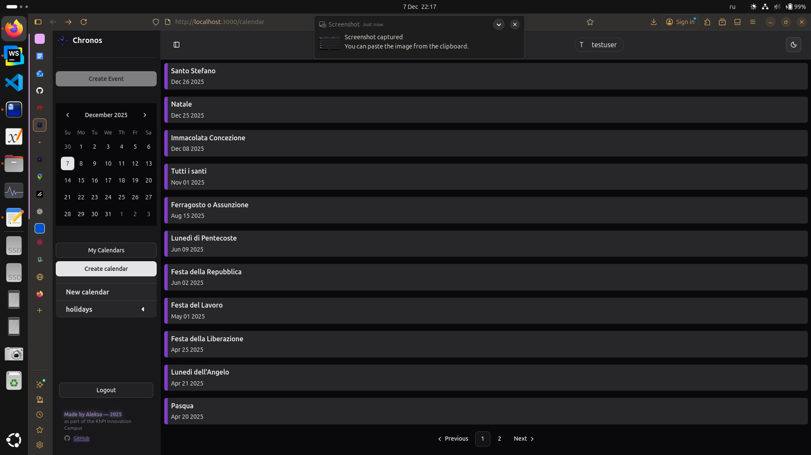
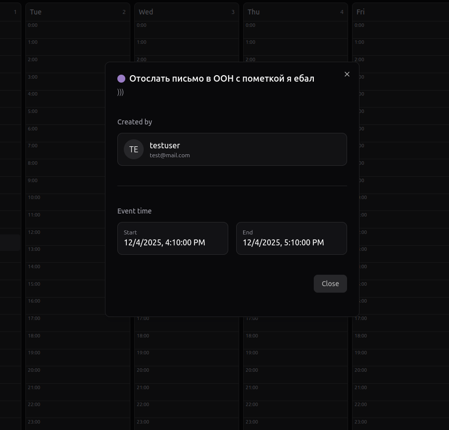
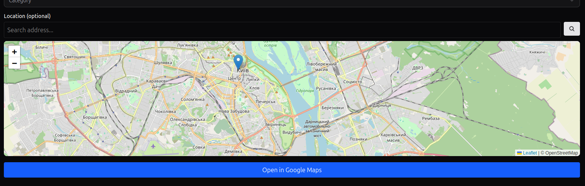

Chronos Project Documentation
Short Description

Chronos is a full-stack web application designed to manage events and calendars. It allows users to create, edit, and delete events, set reminders, assign categories, and organize schedules efficiently. The app features real-time updates, map integration for event locations, and user authentication.

Screenshots

Frontend: Event List View

Frontend: Event Details and Editing

Mini Map Picker for Event Locations

Requirements and Dependencies
Backend

Node.js >= 20

TypeScript

Express.js

Mongoose (MongoDB ODM)

MongoDB

dotenv

nodemon (for development)

Frontend

Node.js >= 20

Vite

React

shadcn/ui components

sonner (toast notifications)

Other Tools

Docker & Docker Compose (for local development and deployment)

Git

How to Run Your Solution

Clone the repository

git clone ssh://git@git.green-lms.app:22022/challenge-372/oadamenko-6500.git
cd oadamenko-6500

Install dependencies

# Backend
cd backend
npm install

# Frontend
cd ../frontend
npm install

Configure environment

Copy .env.example to .env and set your environment variables (MongoDB URI, ports, etc.)

Run using Docker Compose (recommended)

docker compose up --build

Backend runs on http://localhost:5000

Frontend runs on http://localhost:3000

Mailhog for email testing on http://localhost:8025

Run without Docker

# Backend
cd backend
npm run dev

# Frontend
cd frontend
npm run dev

Documentation of Progress (CBL Stages)
1. Engage

Defined the problem: create a calendar and event management web app.

Gathered requirements: multi-user event management, reminders, map location, real-time updates.

Planned initial architecture: backend (Node.js/Express + MongoDB) + frontend (React + Vite).

2. Investigate

Explored existing solutions and UI libraries (shadcn/ui, sonner).

Designed data models: Event, Category, User.

Investigated Docker Compose for local dev setup.

Created initial database schemas with Mongoose.

3. Act

Implemented authentication and authorization.

Developed event creation, editing, and deletion.

Added repeat events logic, reminders, and category selection.

Integrated map picker for event locations.

Implemented full frontend UI with responsive components.

Set up real-time updates and notifications.

Algorithm of the Program

User Authentication

Users register and login.

JWT tokens are used for session management.

Redis stores active sessions.

Event Management

Users can create events with title, description, start/end dates, category, location, and reminders.

Backend validates all fields and stores events in MongoDB.

Events can repeat with configurable periods.

Frontend Workflow

React components fetch calendar and event data via REST API.

State is managed via custom hooks (useCalendar, useEvent).

UI updates in real-time when events are added or edited.

Repeat Event Logic

User can select repeat frequency: daily, weekly, monthly.

Start and end repeat dates are validated.

All generated occurrences are stored in the database for notifications and reminders.

Reminders

Optional reminder times are set for events.

Backend triggers notifications based on event times.

Location Integration

Users can pick a location via MiniMapPicker.

Latitude/longitude are stored in the event document.

Category Management

Users can select or create categories for events.

Categories are displayed in dropdowns and color-coded.

Notes for Future Work

Add collaborative features: share calendars between users.

Improve notifications system (email, push notifications).

Add recurring event exceptions (skip certain dates).

Optimize Docker images for production deployment.****